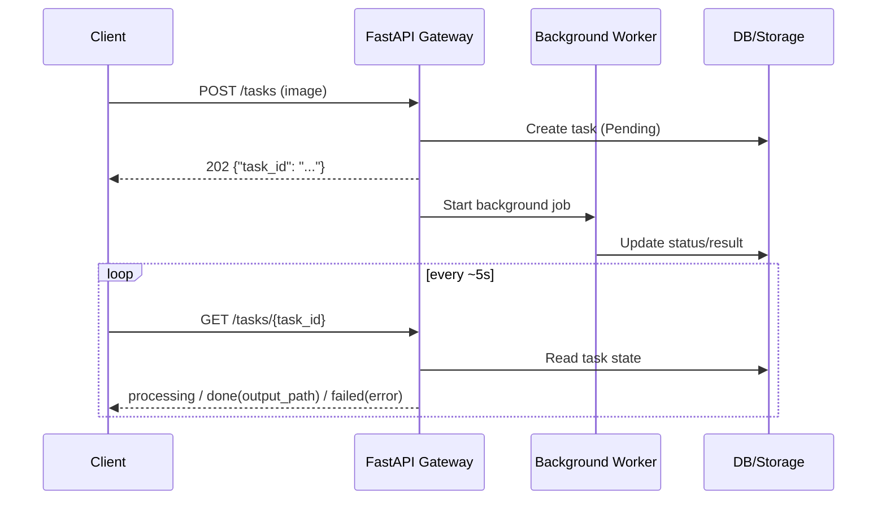

# Product Requirements Document (PRD): AI Model API Gateway
**Version:** v1.0  
**Status:** Baseline v1 — ready for implementation; see **§6** for scope tracking.  
**Tech Stack:** Python, FastAPI, SQL Database *(React is **not** part of MVP; optional in **Phase 2** for Dashboard / Playground — FR-8/FR-9.)*

---

## 1. Executive Summary
The AI Model API Gateway is an **internal-first**, centralized platform that exposes specialized AI models through a **gateway** layer: authentication, file handling, and request lifecycle management. Delivery follows an **API-first** strategy for internal developers via HTTP APIs.

**MVP (internal):** Ship **one** model workflow first: **2D background removal** (outputs `.png`, `.jpg`). The architecture **reserves extension points** so additional pipelines (e.g. 2D→3D, voice) and future **external API consumers** can be added without breaking the core contract; those capabilities stay **out of scope for MVP** until scheduled. **External developer access** is **not implemented** in MVP; **compatibility requirements** (auth model, extensible API contract) are **defined** so a later external rollout does not require a breaking redesign. Go-live and policy for external use remain **TBD**.

**Out of scope for MVP:** Full-featured dashboard, multi-model parity, and guaranteed external-facing productization. Refer to **§2.1** for the definitive scope boundary between MVP and future phases.

---

## 2. User Personas

**API-first (MVP):** The product serves **developers only** through **HTTP APIs** in MVP.

### 2.1 Scope Boundary (Now vs. Later)

| Area | MVP (Now) | Phase 2 / Later |
| :--- | :--- | :--- |
| **Access channel** | API clients, scripts, internal tools | Optional lightweight React Dashboard / Playground |
| **Model capability** | 2D background removal | 2D->3D, Voice |
| **Primary users** | Internal Developers | External Developers (policy and rollout TBD) |
| **Worker stack** | FastAPI BackgroundTasks | Brokered workers (e.g. Celery/Redis), if thresholds are met |

| Persona | MVP scope | Description | Primary Goal |
| :--- | :--- | :--- | :--- |
| **Internal Developer** | **In scope (MVP)** | Internal engineers who call the gateway. Delivery is **API-only** in MVP (no dedicated React application). | **Invoke and test** the gateway end-to-end; initial capability is **2D background removal** (`.png`, `.jpg`). |
| **External Developers** | **Phase 2 / Future** *(MVP: not supported)* | Future third-party integrators. MVP **defines compatibility** (e.g. auth model, API contract extensibility) for a later **external-facing** rollout; **no external onboarding or production external access** is implemented in MVP. | *N/A in MVP* — future: integrate client apps using the same stable API surface once opened. |

---

## 3. Functional Requirements (FR)

### 3.1 Core Model Services

**MVP (in scope)**

* **FR-1: 2D-to-2D Processing:** Image **background removal** (Output: `.png`, `.jpg`).

**Phase 2 / Reserved** *(not MVP; extension points and contracts should avoid blocking these)*

* **FR-2: 2D-to-3D Generation:** Conversion of 2D images into 3D mesh assets (Output: `.obj`, `.ply`).
* **FR-3: Voice-to-Voice Conversion:** Audio processing/style transfer (Output: `.mp4`, `.wav`).

### 3.2 System & API Management

* **FR-4: API Key Authentication:** MVP uses header-based API key authentication stored in the Database, while preserving extension points for stronger security and external key/tenant models in later phases without breaking internal flows.
* **FR-5: File Management:** Automated storage of model outputs with unique URI generation. **Storage cleanup is out of scope for MVP but must be monitored** (disk usage/capacity trend) to avoid uncontrolled growth during internal testing.
* **FR-6: Request Logging:** Every request must be logged (User ID, Model Type, Timestamp, Status).
* **FR-7: Machine-Readable API Specification:** Provide an **OpenAPI** (Swagger) description of the HTTP API **generated from or validated against** the FastAPI implementation, so internal developers can discover endpoints, schemas, and test calls **without a dedicated UI**.
* **FR-10: Async Job Contract (MVP, locked):** 2D background removal uses an asynchronous API contract.
  * **Submission:** **POST** accepts the image and returns immediately with `{"task_id": <id>}`.
  * **Status query:** **GET** by `task_id` returns task state (`processing` / `done` / `failed`); when done, response includes `output_path`; when failed, response includes error fields.
  * **Output reference contract:** `output_path` means a valid, client-usable file reference (path or URL form as implemented) and must be **accessible to the client via Gateway delivery** (e.g. static file serving) when task status is `done`.
  * **Input limits:** Supported input formats are **JPG / PNG / WEBP**; maximum single file size is **20 MB**; over-limit requests return a defined error code.
  * **Timeout and polling:** A single task is marked as **Failed** after **300 seconds** timeout; recommended client polling interval is **5 seconds**.
  * **Read-only rule:** Repeated **GET** for the same `task_id` returns current state only and **must not** enqueue or re-run inference; **only POST** creates a new task/job.
  * **Endpoint paths source of truth:** API endpoint paths are governed by the FastAPI-generated **OpenAPI** specification.
  * **Spec source of truth:** Detailed response fields and error code definitions are governed by the FastAPI-generated **OpenAPI** specification.

### 3.3 Phase 2 — Web UI (React, non-committed)

*Not part of MVP; may be evaluated after the API flow is stable (see §1 / §2).*

* **FR-8: Developer Dashboard:** A UI to view API usage history and download previous results.
* **FR-9: API Console:** A web-based “Playground” to test model inputs without writing code.

---

## 4. Technical Architecture & Flow

### 4.1 Logic Sequence

Authenticated **HTTP clients** call **FastAPI**. The execution follows the standard **Async Task Pattern** defined in **FR-10**.

**Storage response rule (MVP):** Output location is centrally managed by the Gateway. In MVP, return `output_path` mapped to server-designated static directories for fastest delivery. In Phase 2, an additional `url` field (e.g. pre-signed URL) may be introduced without changing the core task contract.

**Phase 2 (reserved):** Pipelines such as **3D / Voice** (FR-2/FR-3) are expected to favor **async** jobs and may require a **task queue** (e.g. Celery/Redis); technology choices remain **TBD** (see §5 / §6).

### 4.2 Data Schema (High-Level)

**Task state (required):** The system must maintain **one persistent task/job record per submission**, stored in the **database** or an **equivalent durable store**. **GET** by **`task_id`** **reads this stored state** (e.g. processing, done, failed, plus `output_path` / error fields when applicable)—it **does not** re-run inference; the background worker updates the same record when the job finishes.

**Identifier mapping rule:** Internal job records must maintain a **one-to-one unique mapping** with externally exposed `task_id`.

The schema **reserves forward compatibility** for **multi-tenant** and **external** access patterns (e.g. namespacing keys, optional tenant identifiers). **MVP implements only single-tenant product logic**—one logical partition for the internal organization—while allowing the **data model and service boundaries** to **extend** to multiple tenants later without a breaking redesign.

* **Users Table:** `id`, `api_key`, `created_at`, `status` *(optional reserved columns, e.g. `tenant_id`, may be added **nullable** in MVP to avoid painful migrations; runtime behavior treats all rows under **single-tenant** semantics).*
* **Jobs Table:** `job_id`, `user_id`, `model_type`, `input_path`, `output_path`, `status` (Pending/Success/Fail).

---

## 5. Non-Functional Requirements

### 5.1 Scalability

* **MVP (2D background removal):** The gateway must sustain expected **internal** request volume and latency for the **2D** async pipeline (FR-10, §4.1) using **FastAPI BackgroundTasks** as the baseline implementation. This avoids broker overhead and is sufficient for initial internal usage (e.g. 3-5 concurrent testers). The **HTTP contract is fixed**; implementation can evolve later if load requires.
* **Phase 2 (reserved):** **3D / Voice** (FR-2/FR-3) are **long-running** and are expected to rely on **asynchronous** processing and **durable jobs**; capacity planning and worker topology apply when those features are scheduled.

### 5.2 Security

**Current approach (MVP — “N” for hardening):**

**Design intent:** The security design must remain extensible for later hardening and externalization, but MVP prioritizes fast internal delivery with explicit trade-offs.

* **Transport:** **HTTPS is mandatory** for all client↔API traffic (baseline: confidentiality and integrity on the wire).
* **Storage:** **API keys are stored in plaintext** in the database in MVP to **speed up development and debugging** (explicit trade-off).
* **Logging:** **Strict log redaction** of secrets is **not** required in MVP; teams should still avoid **needlessly** printing full keys in routine logs.
* **Usage control (MVP):** Strict quota enforcement is **not** required in MVP, but logging/monitoring must detect abnormal high-frequency API calls.

**Future hardening (Phase 2 — “Y”):**

* **Storage upgrade:** Introduce **hashing** (or equivalent) for API key material at rest.
* **Logging policy:** Enforce **no-logging** of sensitive key values (and related **no-logging policy** guardrails).

### 5.3 Reliability

* The **database** must retain enough state to **debug failures** (including **failed jobs/tasks** per FR-6 and the Jobs model).
* **Observability:** Requests and/or jobs must carry a **correlation identifier** (e.g. `request_id` / `job_id`) so operators can **tie logs and records** together when investigating incidents.

---

## 6. Scope and Open Items

**Document:** Version **1.0** · Last consolidated **2026-03-23** *(change this date when §6 is updated).*

### 6.1 MVP Scope (Now)

| Area | Status | Detail *(primary reference)* |
| :--- | :--- | :--- |
| Product shape | Locked | Internal-first, API-first, first model is 2D background removal (§1–§3). |
| Execution model | Locked | Async task pattern: POST -> `task_id` -> GET polling -> `done` + `output_path` / `failed` + error (FR-10, §4.1). |
| Worker implementation | Locked | FastAPI BackgroundTasks in MVP (no Celery/Redis) for low operational overhead (§5.1). |
| Data partition | Locked | Single-tenant behavior in MVP; schema reserves future extension (§4.2). |
| Security baseline | Locked | HTTPS mandatory; API keys plaintext in DB for MVP trade-off; no strict log redaction (§5.2). |

### 6.2 Future Scope (Later / Phase 2)

| Area | Status | Detail *(primary reference)* |
| :--- | :--- | :--- |
| Externalization policy and timeline | Future / TBD | Define external onboarding policy, go-live conditions, and release timeline for external developers before externalization (§1). |
| React Dashboard / Playground | Phase 2 (non-committed) | FR-8/FR-9, evaluate after API stabilization (§3.3). |
| Additional model pipelines | Phase 2 / reserved | 2D->3D and Voice (FR-2/FR-3). |
| Security hardening | Phase 2 | Hashing at rest and no-logging policy for secrets (§5.2). |
| Brokered worker stack | Future option | Celery/Redis (or equivalent) after load/ops thresholds are met (§5.1). |
| Scale-out trigger thresholds | Future / TBD | Define explicit throughput, queue latency, and failure-rate thresholds for migration from FastAPI BackgroundTasks to brokered workers. |

**Summary:** MVP scope is locked for implementation. Future scope and related decisions are reserved for later phases and **do not block MVP delivery**.