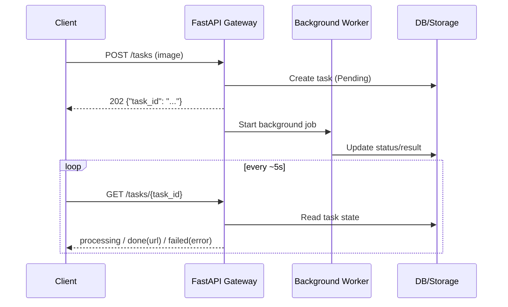

# Product Requirements Document (PRD): AI Model API Gateway
**File:** `docs/PRD_v1.md` *(filename unchanged; version in header)*  
**Version:** v1.1  
**Status:** v1.1 — product requirements baseline; scope and tracking in **§6**. *(v1.1: FR-10 **413** for over-limit; legacy endpoint **ADR + deprecation header**; FR-5 **80% alert** threshold; §5.1 **load test** gate before Phase 2.)*  
**Tech Stack:** Python, FastAPI, SQL Database, **React** (Vite client in the Life-Course-Remove-Background repo).

*(**MVP** = **§6.1** / **Phase 1**: **API-first gateway** (FR-10, API key, SQL, OpenAPI, BackgroundTasks) **and** the **in-repo React client**—both are **in scope for acceptance** (mandatory internal E2E verification). **FR-8 / FR-9** *full* Dashboard / Playground are **Phase 2**. See **§3** *Feature Matrix*.)*

**Purpose:** This document is the **product requirements specification**: it defines **what the product must satisfy** (features, behavior, and boundaries) for **acceptance** and **implementation alignment**. It is **normative**—engineering and design should converge here unless **§6** or an explicit exception says otherwise.  
**It does not describe the current codebase.** For the **Phase 0 as-implemented** snapshot, use **`docs/PHASE0_AS_IS.md`** and the Phase 0 column in **§3** (*Feature Matrix*).

---

## 1. Executive Summary

### Phase roadmap & stacking principles (document consolidation)

This document uses **Phase 0–3** labels to align **implementation milestones** with the product narrative (**MVP** vs. **Phase 2 / later**) used elsewhere in this PRD:

| Phase | Role *(summary)* |
| :--- | :--- |
| **0** | **As-is baseline** for the Life-Course-Remove-Background codebase (e.g. synchronous background-removal flow, no SQL DB). **Authoritative snapshot:** `docs/PHASE0_AS_IS.md`. |
| **1** | **Gateway MVP** (this PRD **§6.1**): FR-10 async task contract, API key, SQL persistence, OpenAPI, BackgroundTasks baseline **plus in-repo React client acceptance**—**not** the Phase 0 code snapshot alone. |
| **2** | **Extended product capabilities** (e.g. optional React Dashboard / Playground — FR-8/FR-9, additional pipelines, hardening when scheduled). See **§2.1** and **§6.2** for the product “Phase 2” scope. |
| **3** | **Operational / deployment alignment** — reverse-proxy and upload limits **consistent with FR-10** (e.g. **10 MB**), monitoring; detailed checklist in `docs/sdd_v1.md` as consolidated. |

**Stacking principles:** New phases **add** capabilities; existing endpoints are **not** assumed removed unless explicitly scheduled. In particular, **`POST /api/remove-background`** may **coexist** with the versioned task API (paths per **`docs/sdd_v1.md`**, e.g. `/api/v1/tasks`) while clients migrate. **Authoritative HTTP behavior** for the task contract is **FR-10** and the **FastAPI-generated OpenAPI** specification once published.

**Phase-by-phase evolution:** The **Feature Matrix** (Phase 0–3) is under **§3** (*Feature Matrix*).

The AI Model API Gateway is an **internal-first**, centralized platform that exposes specialized AI models through a **gateway** layer: authentication, file handling, and request lifecycle management. Delivery follows an **API-first** strategy for internal developers via HTTP APIs.

**MVP (internal):** Ship **one** model workflow first: **2D background removal** (outputs `.png`, `.jpg`). The architecture **reserves extension points** so additional pipelines (e.g. 2D→3D, voice) and future **external API consumers** can be added without breaking the core contract; those capabilities stay **out of scope for MVP** until scheduled. **External developer access** is **not implemented** in MVP; **compatibility requirements** (auth model, extensible API contract) are **defined** so a later external rollout does not require a breaking redesign. Go-live and policy for external use remain **TBD**.

**Out of scope for MVP:** Full-featured dashboard, multi-model parity, and guaranteed external-facing productization. Refer to **§2.1** for the definitive scope boundary between MVP and future phases.

---

## 2. User Personas

**API-first (MVP):** The product serves **developers only** through **HTTP APIs** in MVP.

### 2.1 Scope Boundary (Now vs. Later)

| Area | MVP (Now) | Phase 2 / Later |
| :--- | :--- | :--- |
| **Access channel** | API clients, scripts, internal tools, **in-repo React** (MVP **acceptance**) | Optional **full** React Dashboard / Playground (**FR-8 / FR-9**) |
| **Model capability** | 2D background removal | 2D->3D, Voice |
| **Primary users** | Internal Developers | External Developers (policy and rollout TBD) |
| **Worker stack** | FastAPI BackgroundTasks | Brokered workers (e.g. Celery/Redis), if thresholds are met |

| Persona | MVP scope | Description | Primary Goal |
| :--- | :--- | :--- | :--- |
| **Internal Developer** | **In scope (MVP)** | Internal engineers who call the gateway. MVP includes the **in-repo React** client for **acceptance** and **E2E** verification with the API (see **Tech Stack** above). **FR-8 / FR-9** *full* Dashboard / Playground are **Phase 2**. | **Invoke and test** the gateway end-to-end; initial capability is **2D background removal** (`.png`, `.jpg`). |
| **External Developers** | **Phase 2 / Future** *(MVP: not supported)* | Future third-party integrators. MVP **defines compatibility** (e.g. auth model, API contract extensibility) for a later **external-facing** rollout; **no external onboarding or production external access** is implemented in MVP. | *N/A in MVP* — future: integrate client apps using the same stable API surface once opened. |

---

## 3. Functional Requirements (FR)

### Feature Matrix (Phase 0–3)

Cross-phase coverage for the Life-Course-Remove-Background consolidation. **Phase labels** match **§1**. **Product “MVP”** maps primarily to **Phase 1** implementation work; **Phase 0** is the documented as-is baseline (`docs/PHASE0_AS_IS.md`).

| Area | Phase 0 | Phase 1 | Phase 2 | Phase 3 |
| :--- | :--- | :--- | :--- | :--- |
| **Baseline snapshot** | `docs/PHASE0_AS_IS.md` | Gateway MVP alignment with this PRD | Extended capabilities (see **§6.2**) | Ops alignment (proxy, **FR-10** limit, monitoring) |
| **2D background removal (FR-1)** | Yes — synchronous `POST /api/remove-background` | Yes — FR-10 async task API + worker; **legacy endpoint retained** | Yes | Yes |
| **FR-10 async task contract** (`POST` → `task_id` → `GET` polling) | No | **Yes** (paths per OpenAPI / SDD, e.g. `/api/v1/tasks`) | Yes | Yes |
| **API key auth (FR-4)** | No | Yes | Yes (hardening optional) | Yes |
| **SQL persistence — users / jobs / logs (FR-5, FR-6)** | No | Yes | Yes | Yes |
| **OpenAPI (FR-7)** | Not required for Phase 0 baseline | Yes | Yes | Yes |
| **Single-file upload limit (FR-10)** | **10 MB** | **10 MB** (normative; matches **`docs/PHASE0_AS_IS.md`** Phase 0 implementation) | **10 MB** unless product re-opens limit | **10 MB** end-to-end (app + **Nginx** / infra — see SDD checklist); **raising** the limit is a **product change** (revisit FR-10) |
| **React client (in-repo) — acceptance** | Yes (Phase 0 UI) | **Yes** — **MVP acceptance** (E2E with gateway API) | Yes (evolves with product) | Yes |
| **FR-8 / FR-9** (full Dashboard / Playground) | No | **Phase 2** *(beyond lightweight verification UI)* | Optional | Optional |
| **FR-2 / FR-3 pipelines** | No | No | When scheduled | When scheduled |

---

### 3.1 Core Model Services

**MVP (in scope)**

* **FR-1: 2D-to-2D Processing:** Image **background removal** (Output: `.png`, `.jpg`).

**Phase 2 / Reserved** *(not MVP; extension points and contracts should avoid blocking these)*

* **FR-2: 2D-to-3D Generation:** Conversion of 2D images into 3D mesh assets (Output: `.obj`, `.ply`).
* **FR-3: Voice-to-Voice Conversion:** Audio processing/style transfer (Output: `.mp4`, `.wav`).

### 3.2 System & API Management

* **FR-4: API Key Authentication:** MVP uses header-based API key authentication stored in the Database, while preserving extension points for stronger security and external key/tenant models in later phases without breaking internal flows.
* **FR-5: File Management:** Automated storage of model outputs with unique URI generation. **MVP deliverable (replacing automatic cleanup):** **Manual monitoring and manual cleanup SOP** (runbook). **Automatic deletion / TTL cleanup is out of scope for MVP.**
  * **Monitoring:** Track **disk usage** (and trend). **Alert threshold:** **80%** of provisioned space (or a defined absolute floor)—**no silent exhaustion**; exact value configurable per environment. Phase 3 ops alignment formalizes this in the SDD checklist.
  * **Runbook (SOP):** Maintain a **manual cleanup SOP** (who may delete what, where outputs live, how to verify service health after cleanup) so operators can intervene **before** full-disk outage. Large bulk deletes should be **planned** to avoid I/O storms during peak inference. This **SOP is an MVP deliverable**.
  * **Rationale:** Unplanned **full disk** can cause **total API failure** (upload + inference); **unbounded growth** without monitoring is an operational risk (see **§6.4** open items if policy tightens).
* **FR-6: Request Logging:** Every request must be logged (User ID, Model Type, Timestamp, Status).
* **FR-7: Machine-Readable API Specification:** Provide an **OpenAPI** (Swagger) description of the HTTP API **generated from or validated against** the FastAPI implementation, so internal developers can discover endpoints, schemas, and test calls **without a dedicated UI**.
* **FR-10: Async Job Contract (MVP, locked):** 2D background removal uses an asynchronous API contract.
  * **Submission:** **POST** accepts the image and returns immediately with `{"task_id": <id>}`.
  * **Status query:** **GET** by `task_id` returns task state (`processing` / `done` / `failed`); when done, response includes `url`; when failed, response includes error fields.
  * **Output reference contract:** `url` means a valid, client-usable file reference (path or URL form as implemented) and must be **accessible to the client via Gateway delivery** (e.g. static file serving) when task status is `done`. *(Aligned with Phase 0 legacy endpoint response shape.)*
  * **Input limits:** Supported input formats are **JPG / PNG / WEBP**; maximum single file size is **10 MB** (aligned with the Phase 0 baseline in **`docs/PHASE0_AS_IS.md`**); over-limit requests return **413 Payload Too Large** (or equivalent per OpenAPI). **Increasing** this limit requires a **product decision** and updates to **FR-10**, clients, and infra (e.g. reverse-proxy body size).
  * **Timeout and polling:** A single task is marked as **Failed** after **300 seconds** timeout; recommended client polling interval is **5 seconds**.
  * **Read-only rule:** Repeated **GET** for the same `task_id` returns current state only and **must not** enqueue or re-run inference; **only POST** creates a new task/job.
  * **Endpoint paths source of truth:** API endpoint paths are governed by the FastAPI-generated **OpenAPI** specification.
  * **Spec source of truth:** Detailed response fields and error code definitions are governed by the FastAPI-generated **OpenAPI** specification.
  * **Phase 0 endpoint retention:** The **Phase 0** endpoint **`POST /api/remove-background`** (synchronous) must be **retained and supported**—no removal without an explicit deprecation decision. Its **transformation strategy** (internal delegation to the task API vs parallel implementation) is a **Phase 1 technical focus**; a **decision must be recorded** (e.g. in an ADR). Phase 1 may add a **`Deprecation`** or **`Warning`** header on the legacy endpoint to encourage migration to the versioned task API. See **§6.4** open items.

### 3.3 Phase 2 — Web UI (React, non-committed)

*The **in-repo React** stack is **in MVP acceptance scope** (see **Tech Stack** and **§3** *Feature Matrix*). **FR-8** and **FR-9** here mean a **full** Dashboard / Playground—**Phase 2** (evaluate after the core API flow is stable).*

* **FR-8: Developer Dashboard:** A UI to view API usage history and download previous results.
* **FR-9: API Console:** A web-based “Playground” to test model inputs without writing code.

---

## 4. Technical Architecture & Flow

### 4.1 Logic Sequence

Authenticated **HTTP clients** call **FastAPI**. The execution follows the standard **Async Task Pattern** defined in **FR-10**.

**Storage response rule (MVP):** Output location is centrally managed by the Gateway. In MVP, return `url` mapped to server-designated static directories for fastest delivery (e.g. `/static/outputs/<uuid>.png`). In Phase 2, an additional pre-signed or absolute URL field may be introduced without changing the core task contract.

**Phase 2 (reserved):** Pipelines such as **3D / Voice** (FR-2/FR-3) are expected to favor **async** jobs and may require a **task queue** (e.g. Celery/Redis); technology choices remain **TBD** (see §5 / §6).

### 4.2 Data Schema (High-Level)

**Task state (required):** The system must maintain **one persistent task/job record per submission**, stored in the **database** or an **equivalent durable store**. **GET** by **`task_id`** **reads this stored state** (e.g. processing, done, failed, plus `url` / error fields when applicable)—it **does not** re-run inference; the background worker updates the same record when the job finishes.

**Identifier mapping rule:** Internal job records must maintain a **one-to-one unique mapping** with externally exposed `task_id`.

The schema **reserves forward compatibility** for **multi-tenant** and **external** access patterns (e.g. namespacing keys, optional tenant identifiers). **MVP implements only single-tenant product logic**—one logical partition for the internal organization—while allowing the **data model and service boundaries** to **extend** to multiple tenants later without a breaking redesign.

* **Users Table:** `id`, `api_key`, `created_at`, `status` *(optional reserved columns, e.g. `tenant_id`, may be added **nullable** in MVP to avoid painful migrations; runtime behavior treats all rows under **single-tenant** semantics).*
* **Jobs Table:** `job_id`, `user_id`, `model_type`, `input_path`, `url` (output reference; path or URL form), `status` (Pending/Success/Fail).

---

## 5. Non-Functional Requirements

### 5.1 Scalability

* **MVP (2D background removal):** The gateway must sustain expected **internal** request volume and latency for the **2D** async pipeline (FR-10, §4.1) using **FastAPI BackgroundTasks** as the baseline implementation. This avoids broker overhead and is sufficient for initial internal usage (e.g. 3-5 concurrent testers). The **HTTP contract is fixed**; implementation can evolve later if load requires. **Before exiting Phase 1:** run a **mini load test** to confirm inference does not block the FastAPI event loop; results inform whether the transition to Phase 2 brokered workers should be accelerated.
* **Phase 2 (reserved):** **3D / Voice** (FR-2/FR-3) are **long-running** and are expected to rely on **asynchronous** processing and **durable jobs**; capacity planning and worker topology apply when those features are scheduled.

### 5.2 Security

**Current approach (MVP — “N” for hardening):**

**Design intent:** The security design must remain extensible for later hardening and externalization, but MVP prioritizes fast internal delivery with explicit trade-offs.

* **Transport:** **HTTPS is mandatory** for all client↔API traffic (baseline: confidentiality and integrity on the wire).
* **Storage:** **API keys are stored in plaintext** in the database in MVP to **speed up development and debugging** (explicit trade-off).
* **Logging:** **Strict log redaction** of secrets is **not** required in MVP; teams should still avoid **needlessly** printing full keys in routine logs.
* **Usage control (MVP):** Strict quota enforcement is **not** required in MVP, but logging/monitoring must detect abnormal high-frequency API calls.

**Technical analysis task (planning / governance):** MVP keeps **plaintext** API keys in the database for **development velocity** (see above). A **documented analysis** is required **before** committing to a hardening milestone: **(a)** target **phase** for **hashing** (or equivalent) at rest—**Phase 2** by default, **earlier** if security policy requires; **(b)** impact on **debugging**, **key rotation**, and **ops**; **(c)** migration approach. Record outcomes in a **design review** or **ADR** and link from the backlog.

**Future hardening (Phase 2 — “Y”):**

* **Storage upgrade:** Introduce **hashing** (or equivalent) for API key material at rest.
* **Logging policy:** Enforce **no-logging** of sensitive key values (and related **no-logging policy** guardrails).

### 5.3 Reliability

* The **database** must retain enough state to **debug failures** (including **failed jobs/tasks** per FR-6 and the Jobs model).
* **Observability:** Requests and/or jobs must carry a **correlation identifier** (e.g. `request_id` / `job_id`) so operators can **tie logs and records** together when investigating incidents.

---

## 6. Scope and Open Items

**Document:** Version **1.1** · Last consolidated **2026-03-24** *(change this date when §6 is updated).*

### 6.1 MVP Scope (locked — acceptance / delivery)

The following table locks **what the MVP product is required to deliver**—**not** a claim that the repository already meets these at **Phase 0**. In this PRD, **MVP** means **§6.1** / **Phase 1** alignment unless otherwise stated. For **implementation phase** vs **requirements**, see **§3** (*Feature Matrix*) and **§6.3**.

| Area | Status | Detail *(primary reference)* |
| :--- | :--- | :--- |
| Product shape | Locked | Internal-first, API-first, first model is 2D background removal (§1–§3). |
| Execution model | Locked | Async task pattern: POST -> `task_id` -> GET polling -> `done` + `url` / `failed` + error (FR-10, §4.1). |
| Worker implementation | Locked | FastAPI BackgroundTasks in MVP (no Celery/Redis) for low operational overhead (§5.1). |
| Data partition | Locked | Single-tenant behavior in MVP; schema reserves future extension (§4.2). |
| Security baseline | Locked | HTTPS mandatory; API keys plaintext in DB for MVP trade-off; no strict log redaction (§5.2). |
| Phase 0 endpoint retention | Locked | **`POST /api/remove-background`** retained; transformation strategy is **Phase 1 technical focus** (see **§6.4**). |
| Resource cleanup (FR-5) | Locked | **Manual monitoring and manual cleanup SOP** as **MVP deliverable**; automatic cleanup out of scope (§3.2 FR-5). |

### 6.2 Future Scope (Later / Phase 2)

| Area | Status | Detail *(primary reference)* |
| :--- | :--- | :--- |
| Externalization policy and timeline | Future / TBD | Define external onboarding policy, go-live conditions, and release timeline for external developers before externalization (§1). |
| React Dashboard / Playground | Phase 2 (non-committed) | FR-8/FR-9, evaluate after API stabilization (§3.3). |
| Additional model pipelines | Phase 2 / reserved | 2D->3D and Voice (FR-2/FR-3). |
| Security hardening | Phase 2 | Hashing at rest and no-logging policy for secrets (§5.2). |
| **API key at-rest storage security improvement analysis** | Phase 2 | Evaluate hashing/encryption options, phase for introduction, and impact on debugging/rotation; see §5.2 technical analysis task. |
| Brokered worker stack | Future option | Celery/Redis (or equivalent) after load/ops thresholds are met (§5.1). |
| Scale-out trigger thresholds | Future / TBD | Define explicit throughput, queue latency, and failure-rate thresholds for migration from FastAPI BackgroundTasks to brokered workers. |

### 6.3 Phase mapping (document consolidation)

Maps **implementation phases** (**Phase 0–3**, see **§1**) to **PRD** anchors. The same Phase labels are used in **`docs/sdd_v1.md` §2.3** for SDD chapter mapping.

| Phase | Role | Primary PRD references |
| :--- | :--- | :--- |
| **0** | As-is baseline (code snapshot) | **§1** (Phase table); **§3** Feature Matrix; authoritative detail: **`docs/PHASE0_AS_IS.md`** |
| **1** | Gateway **MVP** — FR-10 task contract, auth, persistence | **§6.1**; **FR-10**; **§4** (architecture / async flow); **§3** Feature Matrix |
| **2** | Extended product scope (post-MVP) | **§6.2**; **§2.1**; **FR-2** / **FR-3**; **FR-8** / **FR-9** |
| **3** | Ops / deployment alignment (**FR-10** **10 MB**, proxy, monitoring per **§1**) | **§3** Feature Matrix (upload row); **FR-10**; SDD checklist (see **`docs/sdd_v1.md`**) |

### 6.4 Open items (decisions — not locked in this PRD)

Items below are **tracked** for **technical and product discussion**; they do **not** block MVP wording elsewhere unless explicitly scheduled.

* **Legacy sync endpoint vs async task API:** **`POST /api/remove-background`** (sync) and the **FR-10** task API (async) are expected to **coexist** during migration (**§1** stacking). **Open:** target **implementation phase**, whether the legacy route should **delegate internally** to the same job/task pipeline as **`POST /api/v1/tasks`** (or equivalent) vs **parallel implementations**, **client migration order**, and deprecation policy. **Phase 1 must produce a decision** (ADR or design review). **Action:** schedule a **technical review**; record **phase**, **owner**, and outcome in the design backlog or ADR.

* **API key at-rest hardening:** Follow the **§5.2 technical analysis task** before locking Phase 2 scope. Document the migration path (plaintext → hashing) in an **ADR** or equivalent.

* **Disk / output growth:** If **FR-5** monitoring thresholds or SOP prove insufficient in production, revisit **automation** (e.g. retention job) as a **separate** scope change.

**Summary:** MVP scope is locked for implementation. Future scope and related decisions are reserved for later phases and **do not block MVP delivery**.