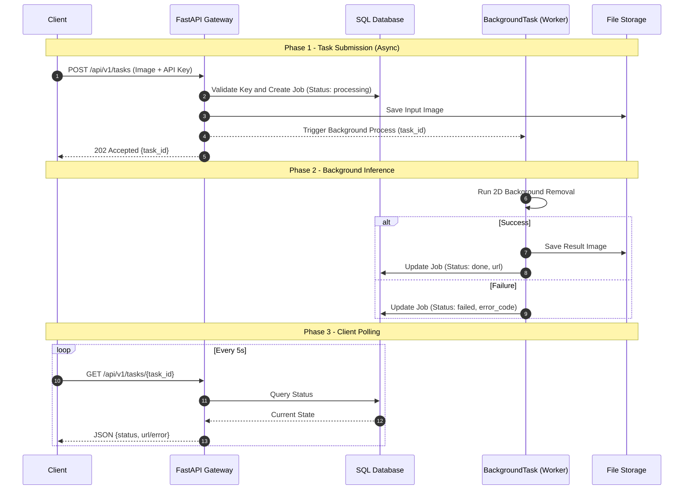
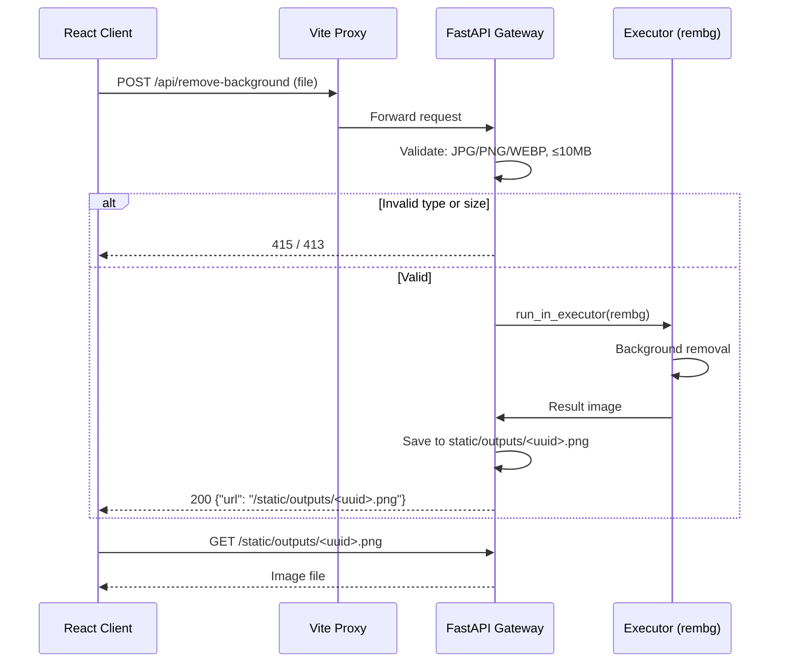
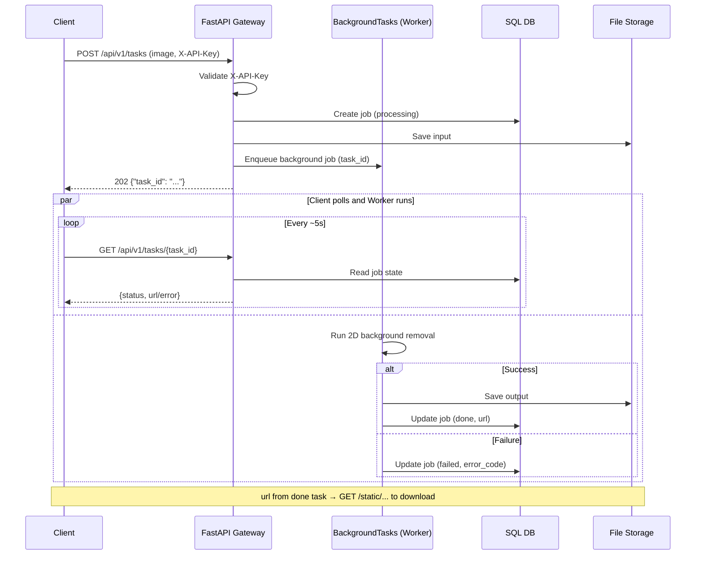
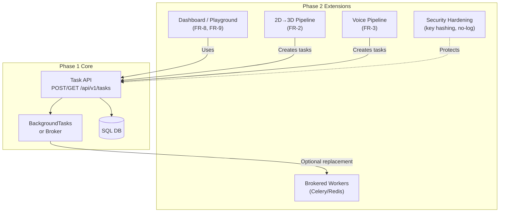
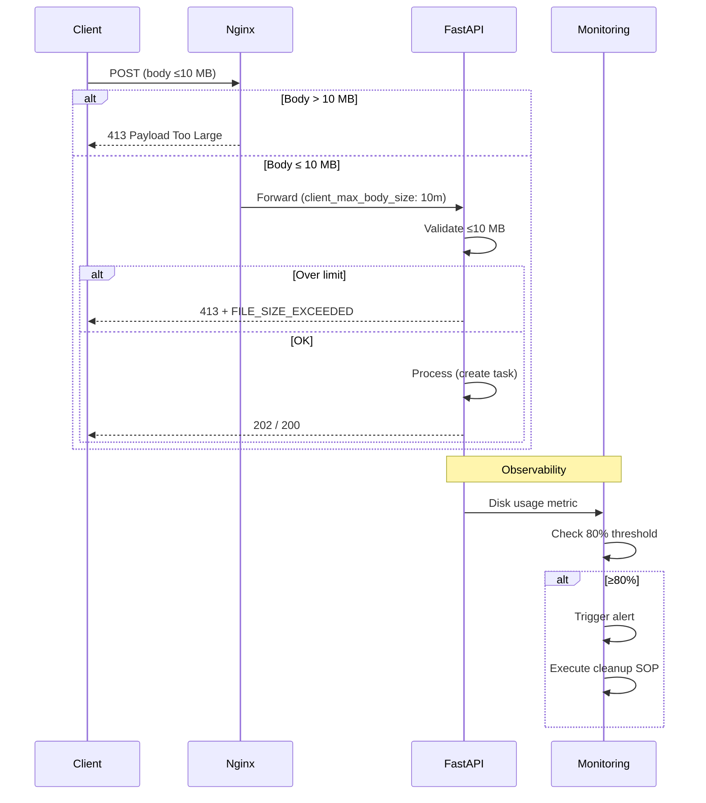

# Software Design Document (SDD): AI Model API Gateway
**Version:** v1.1  
**Status:** Aligned with PRD v1.1; Phase 0–3 implementation and testing strategy defined  
**Based on:** `PRD_v1.md` (v1.1; file `docs/PRD_v1.md`)  
**Last consolidated:** 2026-03-24

---

## 1. Document Purpose
This document defines the software design for MVP implementation, aligned with PRD v1:
- Product shape: internal-first, API-first
- MVP capability: only 2D background removal
- Task contract: asynchronous `POST -> task_id -> GET status`
- Technical baseline: Python + FastAPI + SQL DB + server file storage

---

## 2. Scope Definition

### 2.1 In Scope (v1 MVP)
- API key authentication (header-based, `X-API-Key`)
- Image upload for task creation (JPG/PNG/WEBP, <=10MB per `PRD_v1.md` FR-10 v1.1); over-limit → **413 Payload Too Large**
- Background task execution for background removal (FastAPI BackgroundTasks)
- Task status query (`processing` / `done` / `failed`) via `GET /api/v1/tasks/{task_id}`
- `url` must be client-accessible through Gateway delivery
- Request and task logging with `request_id` / `task_id` correlation
- **in-repo React client** — MVP acceptance / E2E verification with Gateway API (PRD §3 Feature Matrix)
- **Legacy endpoint** `POST /api/remove-background` retained (PRD §6.1)

### 2.2 Out of Scope (Phase 2+)
- **FR-8 / FR-9** full React Dashboard / Playground (MVP requires only in-repo lightweight React for acceptance)
- 2D->3D and Voice pipelines
- External developer onboarding and access policy
- API key hashing and strict secret redaction policy
- Brokered worker stack (e.g., Celery/Redis)

### 2.3 Phase Mapping (PRD Phase 0–3 ↔ this SDD)

Maps **implementation phases** (see **`docs/PRD_v1.md` §1**, **§6.3**) to **this document** for consolidation. **Phase 0** is a documented baseline, not the MVP design target in §2.1.

| Phase | Role *(summary)* | Primary SDD sections |
| :--- | :--- | :--- |
| **0** | As-is codebase (`docs/PHASE0_AS_IS.md`); pre-MVP | **§9 Phase 0** — baseline verification and testing; must pass before entering Phase 1 |
| **1** | Gateway MVP — async tasks, auth, SQL, OpenAPI | **§2.1**, **§3**, **§4**, **§5** (MVP contract as written) |
| **2** | Extended product (UI, pipelines, hardening, optional broker) | **§9 Phase 2**; **§2.2** (out of scope for MVP) |
| **3** | Ops alignment (**FR-10** **10 MB**, Nginx, monitoring) — checklist | **§9 Phase 3**; **§9.3.3** Phase 3 file limit alignment checklist |

---

## 3. System Design Overview

### 3.1 Components
- **API Gateway (FastAPI)**  
  Provides `/api/v1/tasks` async contract, authentication, input validation, and status query.
- **Background Worker (FastAPI BackgroundTasks)**  
  Executes background removal jobs and updates job status.
- **SQL Database**  
  Persists users, jobs, and request logs.
- **File Storage (Server static directories)**  
  Stores uploaded inputs and generated outputs, exposed via Gateway delivery paths.

### 3.2 Core Flow
1. Client calls `POST /api/v1/tasks` with image and API key.
2. Gateway authenticates request, validates file limits, and creates job as `processing`.
3. Gateway returns `202 + {task_id}` immediately and starts background execution.
4. Worker updates job to `done + url` or `failed + error fields`.
5. Client polls `GET /api/v1/tasks/{task_id}` to read current state (read-only, never re-run).

### 3.3 Sequence Diagram (MVP Async Lifecycle)

---

## 4. API Design (MVP Contract)

### 4.1 Legacy Endpoints (Phase 0 Retained)
- **POST** `/api/remove-background`: Phase 0 synchronous background-removal endpoint; **must be retained** (PRD §3.2 FR-10, §6.1). Phase 1 may add `Deprecation` or `Warning` header to encourage migration; transformation strategy (delegate to task API vs parallel implementation) must be recorded in Phase 1 technical decision (ADR).
- **Field**: `multipart/form-data` field name `file`; success returns `{"url": "/static/outputs/<uuid>.png"}`.

### 4.2 POST /api/v1/tasks (FR-10 Task Creation)
- **Headers**: `X-API-Key: <key>`
- **Body**: `multipart/form-data` with image file
- **Validation rules**
  - Supported formats: JPG, PNG, WEBP
  - Max size: 10MB (`PRD_v1.md` FR-10 v1.1); over-limit → **413 Payload Too Large**
- **Responses**
  - `202 Accepted`: `{ "task_id": "..." }`
  - `4xx`: authentication failure, unsupported type, file too large, or invalid request

### 4.3 GET /api/v1/tasks/{task_id}
- **Headers**: `X-API-Key: <key>`
- **Responses**
  - `200`:
    - `processing`: `{ task_id, status }`
    - `done`: `{ task_id, status, url }`
    - `failed`: `{ task_id, status, error_code, error_message }`
  - `404`: task not found or not visible
- **Rules**
  - GET only reads persisted task state.
  - GET must not enqueue or re-run inference.

### 4.4 Timeout and Polling
- Per-task timeout: 300 seconds (mark as `failed` on timeout)
- Recommended polling interval: 5 seconds

---

## 5. Data Model (Minimum Viable Schema)

### 5.1 Users Table
- `id` (PK)
- `api_key` (plaintext in MVP, known trade-off)
- `status` (active/inactive)
- `created_at`
- `tenant_id` (nullable, reserved for future extension)

### 5.2 Jobs Table
- `job_id` (PK, one-to-one external `task_id`)
- `user_id` (FK -> users.id)
- `model_type` (MVP fixed value: `bg_removal_2d`)
- `input_path`
- `url` (nullable; output reference, path or URL form)
- `status` (`processing` / `done` / `failed`)
- `error_code` (nullable)
- `error_message` (nullable)
- `created_at`, `updated_at`
- `completed_at` (nullable, datetime; set when status becomes `done` or `failed` — enables SQL-based inference duration for §7 monitoring: average and P95 processing duration)
- `request_id` (for observability correlation)

### 5.3 Request Log (Table or structured logs)
- `request_id`
- `user_id`
- `endpoint`
- `timestamp`
- `status_code`
- `task_id` (nullable for early rejection)

---

## 6. Error Code Set (MVP Suggested)
- `AUTH_INVALID_KEY`
- `FILE_TYPE_NOT_SUPPORTED`
- `FILE_SIZE_EXCEEDED`
- `TASK_NOT_FOUND`
- `TASK_TIMEOUT`
- `INFERENCE_FAILED`
- `INTERNAL_ERROR`

---

## 7. Observability and Operations
- Generate `request_id` per incoming request and correlate with `task_id`.
- Minimum structured log fields:
  - `timestamp`, `request_id`, `task_id`, `user_id`, `status`, `latency_ms`
- MVP monitoring metrics:
  - task success/failure rate
  - average and P95 processing duration
  - **storage capacity growth trend** — FR-5: **80%** disk usage alert threshold (or environment-configurable absolute value) to avoid silent exhaustion
  - abnormal API call frequency by key

---

## 8. Security Design (MVP)
- HTTPS is mandatory at deployment boundary.
- API key is stored in DB plaintext in MVP (explicit trade-off).
- Strict redaction policy is not mandatory in MVP, but full key printing should be avoided.
- Security hardening (hashing/no-logging) is deferred to Phase 2.

---

## 9. Phased Implementation Plan (PRD Phase 0–3)

This section aligns with **PRD §1**, **§6.3** Phase definitions. Each Phase includes **implementation content** and **Testing Strategy**; **Phase 0 must pass tests** before proceeding to Phase 1.

---

### Phase 0 — As-Is Baseline Verification

**Reference:** `docs/PHASE0_AS_IS.md`  
**Goal:** Establish a baseline **verification suite** aligned with the codebase, ensuring a known-good state before Phase 1 changes; **no new features**.

#### 9.0.0 Core Flow (Phase 0)

Single synchronous HTTP round-trip; no DB, no API key, no BackgroundTasks. Inference runs in-process via `run_in_executor`.

#### 9.0.1 Deliverables

| Item | Description |
|------|-------------|
| **Baseline test suite** | Automated tests covering Phase 0 behavior per `PHASE0_AS_IS.md` |
| **Backend API verification** | `POST /api/remove-background` success flow and error responses |
| **Frontend E2E verification** | Lightweight React client can complete upload and result download |
| **Spec alignment check** | Single file 10 MB, formats JPG/PNG/WEBP, static output path `/static/outputs/` |

#### 9.0.2 Testing Strategy

| Type | Scope | Pass Criteria |
|------|-------|---------------|
| **Unit tests** | Backend input validation (Content-Type, file size constant 10 MB) | Cover `415`, `413`, success path |
| **Integration tests** | `POST /api/remove-background` and `rembg` flow | Valid image returns `200` + `{"url": "/static/outputs/<uuid>.png"}`; over-limit returns `413`; unsupported format returns `415` |
| **E2E tests** | React client → Vite proxy → backend | Select file → submit → get result URL → downloadable |
| **Regression baseline** | Record key metrics (response time, output format) | Establish baseline for Phase 1 comparison |

#### 9.0.3 Phase 0 Exit Criteria (required before entering Phase 1)

- [ ] All baseline tests pass
- [ ] `POST /api/remove-background` behavior matches `PHASE0_AS_IS.md`
- [ ] 10 MB single-file limit verified consistently in backend and frontend
- [ ] Test suite integrated into CI, repeatable

---

### Phase 1 — Gateway MVP (aligned with PRD §6.1)

**Goal:** Implement FR-10 async task contract, API key auth, SQL persistence, OpenAPI, FastAPI BackgroundTasks; **retain** `POST /api/remove-background`.

#### 9.1.0 Core Flow (Phase 1)

Async task pattern: POST returns `task_id` immediately; client polls GET until `done` or `failed`. BackgroundTasks execute inference; DB persists job state.

#### 9.1.1 Implementation Sub-steps (sequential; each step has tests)

| Step | Deliverables | Test Focus |
|------|--------------|------------|
| **1.1 Skeleton** | FastAPI skeleton, health endpoint, OpenAPI (`/docs`, `/openapi.json`), unified error response shape | Service starts, `GET /docs` reachable, health 200 |
| **1.2 Auth & Persistence** | `X-API-Key`, Users table, `POST /api/v1/tasks` creates job (`processing`), `GET /api/v1/tasks/{task_id}` reads status | Valid key gets `202`+`task_id`; invalid key rejected; repeated GET does not mutate state |
| **1.3 File Validation** | Type validation JPG/PNG/WEBP, size <=10MB, 413 over-limit, save uploaded file to input storage | Supported format creates task; unsupported→`FILE_TYPE_NOT_SUPPORTED`; over-limit→`FILE_SIZE_EXCEEDED` / 413 |
| **1.4 Async Execution** | BackgroundTasks runs background removal, write `url` on success, `error_code`/`error_message` on failure | Task reaches `done` with valid `url`; failure reaches `failed` with error fields; GET is read-only and never re-runs |
| **1.5 Output Delivery** | Static file serving, `url` format definition, client downloadable | `url` from `done` task is downloadable |
| **1.6 Reliability** | 300s timeout, `request_id`/`task_id` correlation, basic metrics | Timeout task becomes `failed`; traceable via `request_id` |
| **1.7 Legacy & Hardening** | Retain `POST /api/remove-background` (optional Deprecation header); ADR records transformation strategy; OpenAPI consistent with impl; FR-5 manual cleanup SOP | Legacy endpoint usable; FR-1/4/5/6/7/10 acceptable |

#### 9.1.2 Testing Strategy

| Type | Scope | Pass Criteria |
|------|-------|---------------|
| **Unit tests** | auth, validation, model layer | Each module passes independently |
| **Integration tests** | `POST /api/v1/tasks`, `GET /api/v1/tasks/{id}`, DB write/read | Full async flow completable |
| **E2E tests** | **in-repo React client** (PRD MVP acceptance) | End-to-end verification with Gateway API passes |
| **Load test (Phase 1 gate)** | **PRD §5.1: mini load test** confirms inference does not block FastAPI event loop | 3–5 concurrent internal testers scenario sustainable; results inform Phase 2 broker decision |
| **OpenAPI alignment** | Implementation matches `/openapi.json` | No conflict |

#### 9.1.3 Phase 1 Exit Criteria

- [ ] FR-1, FR-4, FR-5, FR-6, FR-7, FR-10 demonstrably met
- [ ] in-repo React client E2E passes (MVP acceptance)
- [ ] Mini load test passes, no blocking severity defects
- [ ] Manual cleanup SOP (runbook) delivered
- [ ] Legacy endpoint decision recorded (ADR)

---

### Phase 2 — Extended Product Capabilities

**Reference:** PRD §6.2, §2.1  
**Goal:** Optionally introduce Dashboard/Playground (FR-8/FR-9), additional pipelines (2D→3D, Voice), security hardening, or brokered workers.

#### 9.2.0 Core Flow (Phase 2)

Optional capabilities stacked on Phase 1. Dashboard/Playground uses same task API; new pipelines extend task model; broker (if adopted) replaces BackgroundTasks for long-running jobs.

#### 9.2.1 Deliverables (per schedule)

| Item | Description |
|------|-------------|
| **React Dashboard / Playground** | FR-8, FR-9 full implementation or upgrade existing React |
| **Additional pipelines** | FR-2 (2D→3D), FR-3 (Voice) — requires long-running, durable jobs |
| **Security hardening** | API key hashing at rest, no-logging policy (§5.2 technical analysis first) |
| **Brokered workers** | Celery/Redis etc. (if load thresholds met) |

#### 9.2.2 Testing Strategy

| Type | Scope | Pass Criteria |
|------|-------|---------------|
| **Functional tests** | Each new feature per PRD FR | Meets FR-8/FR-9 or related spec |
| **Integration tests** | New pipeline with existing task API | No breaking Phase 1 contract |
| **Security tests** | hashing, key rotation flow | Aligns with design decisions |
| **Regression tests** | Phase 0, Phase 1 baselines | Existing tests continue to pass |

#### 9.2.3 Phase 2 Exit Criteria

- [ ] Scheduled features acceptance passed
- [ ] No breaking changes to Phase 1 contract
- [ ] Security analysis task (if applicable) completed and recorded

---

### Phase 3 — Ops Alignment

**Reference:** PRD §1, §3 Feature Matrix, FR-10  
**Goal:** Single file **10 MB** consistent across full stack; reverse proxy, monitoring, and upload limits aligned.

#### 9.3.0 Core Flow (Phase 3)

Request path through Nginx with body size limit; 10 MB enforced at proxy and backend. Monitoring and alerting wrap the deployed stack.

#### 9.3.1 Deliverables

| Item | Description |
|------|-------------|
| **Phase 3 file limit alignment checklist** | See §9.3.3 below |
| **Monitoring and alerting** | FR-5: 80% disk usage alert threshold; observability improvements |
| **Reverse proxy config** | Nginx `client_max_body_size` aligned with FR-10 |

#### 9.3.2 Testing Strategy

| Type | Scope | Pass Criteria |
|------|-------|---------------|
| **E2E upload test** | Via Nginx → backend, 10 MB boundary | Compliant file accepted; over-limit returns 413 |
| **Monitoring/alert test** | Simulate disk at 80% | Alert triggers, SOP executable |
| **Deployment check** | Checklist items verified | All items pass |
| **Regression tests** | Phase 0, 1, 2 baselines | All pass |

#### 9.3.3 Phase 3 File Limit Alignment Checklist (FR-10 10 MB)

Full-stack checklist when single-file limit aligns with **PRD FR-10**; currently **10 MB**. Raising the limit requires a separate product decision and updates to PRD FR-10, clients, and infra.

| Check Item | Location | Expected |
|-------------|----------|----------|
| Backend constant | `backend/` upload validation | `max_size = 10 * 1024 * 1024` (or equivalent) |
| Backend error code | Over-limit response | HTTP `413 Payload Too Large`; error code `FILE_SIZE_EXCEEDED` |
| Frontend validation | React client | File selection limits 10 MB; copy consistent with backend |
| Frontend error handling | 413 response | User-visible clear error message |
| **Nginx** | `client_max_body_size` | `10m` (or value matching backend) |
| Docs and spec | PRD, SDD, OpenAPI | 10 MB consistently stated |

#### 9.3.4 Phase 3 Exit Criteria

- [ ] All checklist items pass
- [ ] 10 MB boundary test via Nginx passes
- [ ] Monitoring/alerting and SOP deployed and verified

---

## 10. Acceptance Criteria (PRD-aligned)
- API-first delivery; in-repo React client is **MVP acceptance** mandatory item (E2E with Gateway API)
- End-to-end 2D background removal workflow is operational
- Async contract is complete: POST returns task_id; GET returns state; done includes url
- Input limits, timeout, and error handling are testable and reproducible
- Logs and persisted data support failure investigation

---

## 11. Risks and Decisions (MVP)
- Plaintext API key storage accelerates delivery but raises at-rest exposure risk.
- No broker queue simplifies operations but limits scale ceiling.
- No cleanup in MVP speeds implementation but requires active storage monitoring.
- No strict secret redaction policy increases operational discipline requirements.

---

## 12. OpenAPI as Source of Truth
Detailed endpoint paths, response schemas, and error object fields are governed by the FastAPI-generated OpenAPI specification. Any manual document section in conflict must be corrected to match implementation OpenAPI output.
