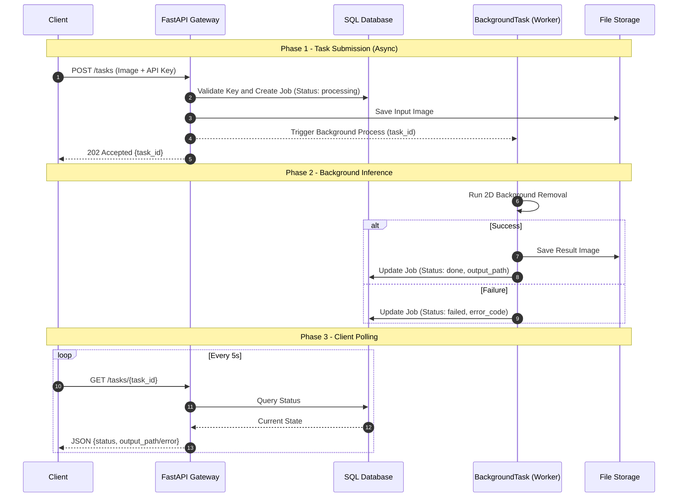

# Software Design Document (SDD): AI Model API Gateway
**Version:** v1.0 (Draft)  
**Status:** Draft for MVP implementation  
**Based on:** `PRD_v1.md` v1.0

---

## 1. Document Purpose
This document defines the software design for MVP implementation, aligned with PRD v1:
- Product shape: internal-first, API-first
- MVP capability: only 2D background removal
- Task contract: asynchronous `POST -> task_id -> GET status`
- Technical baseline: Python + FastAPI + SQL DB + server file storage

---

## 2. Scope Definition

### 2.1 In Scope (v1 MVP)
- API key authentication (header-based)
- Image upload for task creation (JPG/PNG/WEBP, <=20MB)
- Background task execution for background removal
- Task status query (`processing` / `done` / `failed`)
- `output_path` must be client-accessible through Gateway delivery
- Request and task logging with `request_id` / `task_id` correlation

### 2.2 Out of Scope (Phase 2+)
- React Dashboard / Playground
- 2D->3D and Voice pipelines
- External developer onboarding and access policy
- API key hashing and strict secret redaction policy
- Brokered worker stack (e.g., Celery/Redis)

---

## 3. System Design Overview

### 3.1 Components
- **API Gateway (FastAPI)**  
  Provides `/tasks` async contract, authentication, input validation, and status query.
- **Background Worker (FastAPI BackgroundTasks)**  
  Executes background removal jobs and updates job status.
- **SQL Database**  
  Persists users, jobs, and request logs.
- **File Storage (Server static directories)**  
  Stores uploaded inputs and generated outputs, exposed via Gateway delivery paths.

### 3.2 Core Flow
1. Client calls `POST /tasks` with image and API key.
2. Gateway authenticates request, validates file limits, and creates job as `processing`.
3. Gateway returns `202 + {task_id}` immediately and starts background execution.
4. Worker updates job to `done + output_path` or `failed + error fields`.
5. Client polls `GET /tasks/{task_id}` to read current state (read-only, never re-run).

### 3.3 Sequence Diagram (MVP Async Lifecycle)

---

## 4. API Design (MVP Contract)

### 4.1 POST /tasks
- **Headers**: `X-API-Key: <key>`
- **Body**: `multipart/form-data` with image file
- **Validation rules**
  - Supported formats: JPG, PNG, WEBP
  - Max size: 20MB
- **Responses**
  - `202 Accepted`: `{ "task_id": "..." }`
  - `4xx`: authentication failure, unsupported type, file too large, or invalid request

### 4.2 GET /tasks/{task_id}
- **Headers**: `X-API-Key: <key>`
- **Responses**
  - `200`:
    - `processing`: `{ task_id, status }`
    - `done`: `{ task_id, status, output_path }`
    - `failed`: `{ task_id, status, error_code, error_message }`
  - `404`: task not found or not visible
- **Rules**
  - GET only reads persisted task state.
  - GET must not enqueue or re-run inference.

### 4.3 Timeout and Polling
- Per-task timeout: 300 seconds (mark as `failed` on timeout)
- Recommended polling interval: 5 seconds

---

## 5. Data Model (Minimum Viable Schema)

### 5.1 Users Table
- `id` (PK)
- `api_key` (plaintext in MVP, known trade-off)
- `status` (active/inactive)
- `created_at`
- `tenant_id` (nullable, reserved for future extension)

### 5.2 Jobs Table
- `job_id` (PK, one-to-one external `task_id`)
- `user_id` (FK -> users.id)
- `model_type` (MVP fixed value: `bg_removal_2d`)
- `input_path`
- `output_path` (nullable)
- `status` (`processing` / `done` / `failed`)
- `error_code` (nullable)
- `error_message` (nullable)
- `created_at`, `updated_at`
- `request_id` (for observability correlation)

### 5.3 Request Log (Table or structured logs)
- `request_id`
- `user_id`
- `endpoint`
- `timestamp`
- `status_code`
- `task_id` (nullable for early rejection)

---

## 6. Error Code Set (MVP Suggested)
- `AUTH_INVALID_KEY`
- `FILE_TYPE_NOT_SUPPORTED`
- `FILE_SIZE_EXCEEDED`
- `TASK_NOT_FOUND`
- `TASK_TIMEOUT`
- `INFERENCE_FAILED`
- `INTERNAL_ERROR`

---

## 7. Observability and Operations
- Generate `request_id` per incoming request and correlate with `task_id`.
- Minimum structured log fields:
  - `timestamp`, `request_id`, `task_id`, `user_id`, `status`, `latency_ms`
- MVP monitoring metrics:
  - task success/failure rate
  - average and P95 processing duration
  - storage capacity growth trend
  - abnormal API call frequency by key

---

## 8. Security Design (MVP)
- HTTPS is mandatory at deployment boundary.
- API key is stored in DB plaintext in MVP (explicit trade-off).
- Strict redaction policy is not mandatory in MVP, but full key printing should be avoided.
- Security hardening (hashing/no-logging) is deferred to Phase 2.

---

## 9. Phased Implementation Plan
Each phase is designed as the smallest testable MVP increment so the team can validate independently and progress step by step.

### Phase 0 - Skeleton and Spec MVP
**Goal**: Runnable service skeleton with OpenAPI visibility.

**Deliverables**
- FastAPI project skeleton and health endpoint
- OpenAPI generation (`/docs`, `/openapi.json`)
- Unified baseline error response shape

**Self-validation**
- Service can start successfully
- `GET /docs` is reachable
- health endpoint returns 200

### Phase 1 - Auth and Task Persistence MVP
**Goal**: Create/query task records without running model inference.

**Deliverables**
- `X-API-Key` authentication with users table
- `POST /tasks` creates job record as `processing` and returns `task_id`
- `GET /tasks/{task_id}` returns persisted status

**Self-validation**
- Valid key gets `202 + task_id`
- Invalid key is rejected with auth error
- Repeated GET does not mutate state or trigger execution

### Phase 2 - File Validation MVP
**Goal**: Enforce input constraints before execution.

**Deliverables**
- Type validation (JPG/PNG/WEBP)
- File size validation (<=20MB)
- Save uploaded file to input storage

**Self-validation**
- Supported file can create task
- Unsupported type returns `FILE_TYPE_NOT_SUPPORTED`
- Oversized file returns `FILE_SIZE_EXCEEDED`

### Phase 3 - Async Execution MVP
**Goal**: Complete async lifecycle (`processing -> done/failed`).

**Deliverables**
- BackgroundTasks execution pipeline (model can be stubbed initially)
- Write `output_path` on success
- Write `error_code/error_message` on failure

**Self-validation**
- Successful task reaches `done` with valid `output_path`
- Failed task reaches `failed` with error fields
- GET remains read-only and never re-runs inference

### Phase 4 - Output Delivery MVP
**Goal**: Ensure `output_path` is truly client-usable.

**Deliverables**
- Static file serving route
- Defined `output_path` format (relative path or URL form)

**Self-validation**
- `output_path` from `done` task is downloadable by client
- Invalid output reference has defined error behavior

### Phase 5 - Reliability Guardrails MVP
**Goal**: Improve debuggability and operational safety.

**Deliverables**
- 300-second timeout handling (`TASK_TIMEOUT`)
- `request_id` and `task_id` correlation in logs and records
- Basic service/task metrics reporting

**Self-validation**
- Simulated long-running task times out and becomes `failed`
- Incident tracing is possible through `request_id`
- Success/failure trend is observable

### Phase 6 - MVP Hardening Gate
**Goal**: Internal release readiness.

**Deliverables**
- OpenAPI/implementation consistency check
- Freeze v1 response and error contract
- Basic load validation for 3-5 concurrent internal testers

**Self-validation**
- FR-1/FR-4/FR-5/FR-6/FR-7/FR-10 are demonstrably met
- No blocking severity defects for internal rollout
- Rollback and release checklist is executable

---

## 10. Acceptance Criteria (PRD-aligned)
- API-first delivery without UI dependency
- End-to-end 2D background removal workflow is operational
- Async contract is complete: POST returns task_id; GET returns state; done includes output_path
- Input limits, timeout, and error handling are testable and reproducible
- Logs and persisted data support failure investigation

---

## 11. Risks and Decisions (MVP)
- Plaintext API key storage accelerates delivery but raises at-rest exposure risk.
- No broker queue simplifies operations but limits scale ceiling.
- No cleanup in MVP speeds implementation but requires active storage monitoring.
- No strict secret redaction policy increases operational discipline requirements.

---

## 12. OpenAPI as Source of Truth
Detailed endpoint paths, response schemas, and error object fields are governed by the FastAPI-generated OpenAPI specification. Any manual document section in conflict must be corrected to match implementation OpenAPI output.
